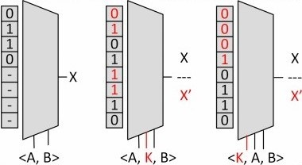

<!--
*** Thanks for checking out the Best-README-Template. If you have a suggestion
*** that would make this better, please fork the repo and create a pull request
*** or simply open an issue with the tag "enhancement".
*** Thanks again! Now go create something AMAZING! :D
***
***
***
*** To avoid retyping too much info. Do a search and replace for the following:
*** BrooksOlney, FPGA_Obfuscation, twitter_handle, brooksolney@usf.edu, Tunable FPGA Bitstream Obfuscation Framework, project_description
-->


<!-- PROJECT SHIELDS -->
<!--
*** I'm using markdown "reference style" links for readability.
*** Reference links are enclosed in brackets [ ] instead of parentheses ( ).
*** See the bottom of this document for the declaration of the reference variables
*** for contributors-url, forks-url, etc. This is an optional, concise syntax you may use.
*** https://www.markdownguide.org/basic-syntax/#reference-style-links
-->
<!-- [![Contributors][contributors-shield]][contributors-url]
[![Forks][forks-shield]][forks-url]
[![Stargazers][stars-shield]][stars-url]
[![Issues][issues-shield]][issues-url]
[![MIT License][license-shield]][license-url]
[![LinkedIn][linkedin-shield]][linkedin-url] -->


<!-- PROJECT LOGO -->
<br />
<p align="center">
  <a href="https://github.com/brooksolney/FPGA_Obfuscation">
    
  </a>

  <h3 align="center">Tunable FPGA Bitstream Obfuscation Framework</h3>

  <p align="center">
    Provides customizable obfuscation framework for FPGA bitstreams, with support for both Intel and AMD FPGA primitives. Supports BLIF parsing and verilog/BLIF output. Can be used as a standalone framework, or customized to integrate with another framework.
    <!-- <br />
    <a href="https://github.com/BrooksOlney/FPGA_Obfuscation"><strong>Explore the docs »</strong></a>
    <br />
    <br />
    <a href="https://github.com/BrooksOlney/FPGA_Obfuscation">View Demo</a>
    ·
    <a href="https://github.com/BrooksOlney/FPGA_Obfuscation/issues">Report Bug</a>
    ·
    <a href="https://github.com/BrooksOlney/FPGA_Obfuscation/issues">Request Feature</a> -->
  </p>
</p>


<!-- TABLE OF CONTENTS -->
<!-- <details open="open">
  <summary><h2 style="display: inline-block">Table of Contents</h2></summary>
  <ol>
    <li>
      <a href="#about-the-project">About The Project</a>
      <ul>
        <li><a href="#built-with">Built With</a></li>
      </ul>
    </li>
    <li>
      <a href="#getting-started">Getting Started</a>
      <ul>
        <li><a href="#prerequisites">Prerequisites</a></li>
        <li><a href="#installation">Installation</a></li>
      </ul>
    </li>
    <li><a href="#usage">Usage</a></li>
    <li><a href="#roadmap">Roadmap</a></li>
    <li><a href="#contributing">Contributing</a></li>
    <li><a href="#license">License</a></li>
    <li><a href="#contact">Contact</a></li>
    <li><a href="#acknowledgements">Acknowledgements</a></li>
  </ol>
</details> -->


<!-- ABOUT THE PROJECT -->
## About The Project

This project is built upon work originally conducted by Professor Robert Karam while at University of Florida (UF) [[1]](#1)[[2]](#2). Once I started working with Dr. Karam at University of South Florida (USF) in Spring 2018, I continued his work by investigating means of _tuning_ and _optimizing_ the existing framework for FPGA bitstream obfuscation. We found that, by optimizing the LUT selection and partitioning strategies, we were able to achieve optimal levels of security -- in terms of functional mismatch -- with minimized overheads in area, power and delay. Further, we integrated the first _practical_ FPGA-based SAT Attack countermeasure with this approach, and published these in a paper in the ACM TODAES journal [[3]](#3). Most recently, we devised a method of replacing the obfuscation function with an HMAC which cryptographically ties the obfuscation approach to the design -- allowing proof of ownership and device authentication [[4]](#4).  

Feel free to use this project as you see fit and adapt it to your own purposes. **_If you are using this software tool to aid in research endeavors, we kindly ask that you cite our paper [[3]](#3) where appropriate, thank you!_** 


### Built With

* Python 3+ (No extra libraries required)


<!-- GETTING STARTED -->
## Getting Started

To get a local copy up and running follow these simple steps.

<!-- ### Prerequisites

This is an example of how to list things you need to use the software and how to install them.
* npm
  ```sh
  npm install npm@latest -g
  ``` -->

<!-- ### Installation -->

1. Clone the repo
   ```sh
   git clone https://github.com/BrooksOlney/FPGA_Obfuscation.git
   ```
2. (Optional) Import ObfuscationEngine as top module into your own python script to access the core functionality of the framework.

3. Use ObfuscationEngine.py in a command line interface.

<!-- USAGE EXAMPLES -->
## Usage

Use this tool to obfuscate your FPGA IP cores by exporting them to BLIF format (for example from Quartus Prime II), and importing them as BLIF into the framework before applying custom obfuscation functions to varying portions of your hardware design. 

To see a list of the command line arguments and possible values, run ```sh python ObfuscationEngine.py -h``` in your terminal. The output will look like this:

```sh
python .\ObfuscationEngine.py -h
usage: ObfuscationEngine.py [-h] [-i I] -vFiles VFILES VFILES [-op OP]
                            [-sat SAT] [-blif BLIF] -m M -v V

required arguments:
  -i I                  Input BLIF file: -i {ckt_name.blif}
  -vFiles VFILES VFILES
                        Verilog output filenames: -vFiles ckt.v ckt_secured.v
  -m M                  FPGA manufacturer (for verilog primitives): -m
                        {xilinx/altera}
  -v V                  Verilog Output Type: -v {comb, lutprim}

optional arguments:
  -op OP                Percentage of design to obfuscate: -op {float(0.0,
                        1.0]}
  -sat SAT              Implement SAT Attack resilience for the circuit: -sat
  -blif BLIF            BLIF ouput filename: -blif {ckt_name.blif}

```

As the prompt suggests, you _must_ provide arguments for the input BLIF file, 2 names for the output verilog files, name of the target FPGA manufacturer, and the verilog output type. These arguments are necessary to instantiate the ObfuscationEngine and allow it to parse your circuit and enable obfuscation and output generation. 

Additionally, there are a few optional arguments that tune the functionality of the framework. The obfuscation percentage (-op) controls how much of the design will be obfuscated by the engine. The SAT Attack argument (-sat) will integrate additional SAT hardening circuitry with your design. Finally, the BLIF (-blif) argument will output your obfuscated design to a BLIF file which is useful for tools such as ABC and the SAT Attack tool itself for verification purposes. 


## Example Use Case

We've laid out how the arguments work, let's go over a small example. Let us consider a (hypothetical) soft processor core that we have constructed and tested in verilog. We have chosen to secure it by obfuscating a critical portion of the processor - the _ALU4_ unit. First, we have to convert the verilog implementation of our ALU4 circuit to a BLIF file. 

The BLIF conversion can be done a few different ways; the first way (which we actually did in the paper) was by adding an obscure directive to the Quartus project configuration file, causing it to crash and output a BLIF reprentation of the circuit. ***Currently do not have documentation for this feature, pending***. The other way would be to use a tool like <a href="https://people.eecs.berkeley.edu/~alanmi/abc/">ABC</a> which supports many different logic synthesis and input/output functions. 

Now that you have the BLIF representation of your circuit, you can make additional considerations about how you wish to secure your design. Let's say for this example, we want to try obfuscating roughly 50% of the ALU4 circuit while integrating SAT Attack resilience. Further, let's assume that we want to output the design in verilog with Altera's LUT primitive format. The appropriate command would look something like this:

```sh
python ObfuscationEngine.py -i alu4.blif -vFiles alu4.v alu4_secured.v -op 0.50 -sat -v lutprim -m altera
```

The tool will implement the techniques described in [[3]](#3) and output to the paths you have provided. 

_Of course if you're savvy enough, you can dig into the code, import it into your codebase and tailor it to your needs!_

<!-- LICENSE -->
## License

Distributed under the MIT License. See `LICENSE` for more information.


<!-- CONTACT -->
## Contact

Brooks Olney - brooksolney@usf.edu

Project Link: [https://github.com/BrooksOlney/FPGA_Obfuscation](https://github.com/BrooksOlney/FPGA_Obfuscation)

## References
<a id="1" href="https://ieeexplore.ieee.org/abstract/document/7857187">[1]</a> R. Karam, T. Hoque, S. Ray, M. Tehranipoor and S. Bhunia, "Robust bitstream protection in FPGA-based systems through low-overhead obfuscation," 2016 International Conference on ReConFigurable Computing and FPGAs (ReConFig), Cancun, 2016, pp. 1-8, doi: 10.1109/ReConFig.2016.7857187.

<a id="2" href="https://ieeexplore.ieee.org/abstract/document/7858391">[2]</a> R. Karam, T. Hoque, S. Ray, M. Tehranipoor and S. Bhunia, "MUTARCH: Architectural diversity for FPGA device and IP security," 2017 22nd Asia and South Pacific Design Automation Conference (ASP-DAC), Chiba, 2017, pp. 611-616, doi: 10.1109/ASPDAC.2017.7858391.

<a id="3" href="https://dl.acm.org/doi/abs/10.1145/3373638">[3]</a> Olney, B., and Karam, R. Tunable FPGA Bitstream Obfuscation with Boolean Satisfiability Attack Countermeasure, ACM Transactions on Design & Automation of Electronic Systems 25, 2 (Feb. 2020).

<a id="4" href="https://ieeexplore.ieee.org/abstract/document/9162123">[4]</a> B. Olney and R. Karam, "WATERMARCH: IP Protection Through Authenticated Obfuscation in FPGA Bitstreams," in IEEE Embedded Systems Letters, doi: 10.1109/LES.2020.3015092.


<!-- MARKDOWN LINKS & IMAGES -->
<!-- https://www.markdownguide.org/basic-syntax/#reference-style-links -->
[contributors-shield]: https://img.shields.io/github/contributors/BrooksOlney/repo.svg?style=for-the-badge
[contributors-url]: https://github.com/BrooksOlney/repo/graphs/contributors
[forks-shield]: https://img.shields.io/github/forks/BrooksOlney/repo.svg?style=for-the-badge
[forks-url]: https://github.com/BrooksOlney/repo/network/members
[stars-shield]: https://img.shields.io/github/stars/BrooksOlney/repo.svg?style=for-the-badge
[stars-url]: https://github.com/BrooksOlney/repo/stargazers
[issues-shield]: https://img.shields.io/github/issues/BrooksOlney/repo.svg?style=for-the-badge
[issues-url]: https://github.com/BrooksOlney/repo/issues
[license-shield]: https://img.shields.io/github/license/BrooksOlney/repo.svg?style=for-the-badge
[license-url]: https://github.com/BrooksOlney/repo/blob/master/LICENSE.txt
[linkedin-shield]: https://img.shields.io/badge/-LinkedIn-black.svg?style=for-the-badge&logo=linkedin&colorB=555
[linkedin-url]: https://linkedin.com/in/BrooksOlney

